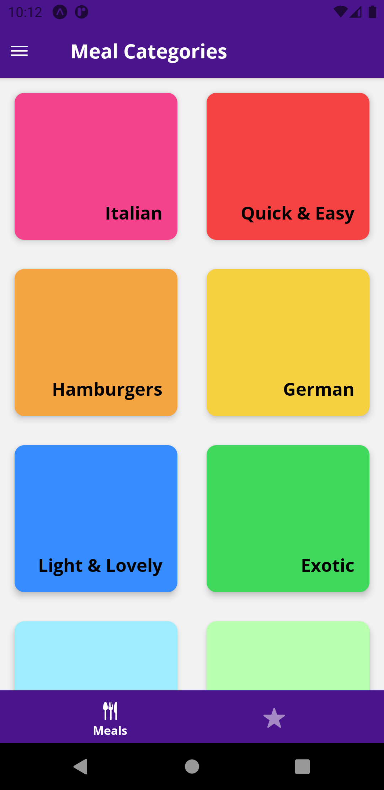
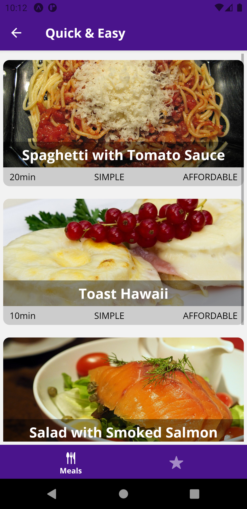
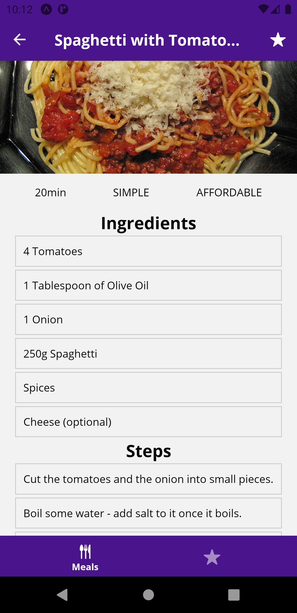
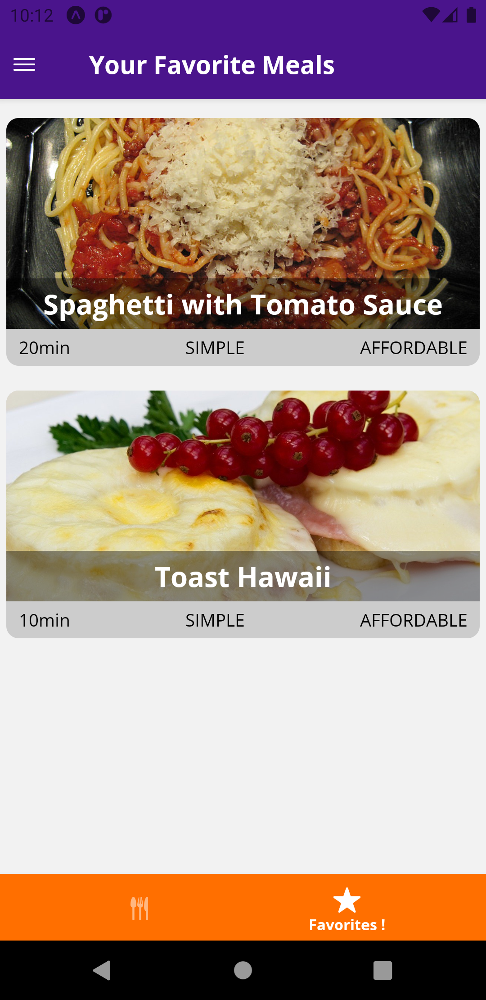
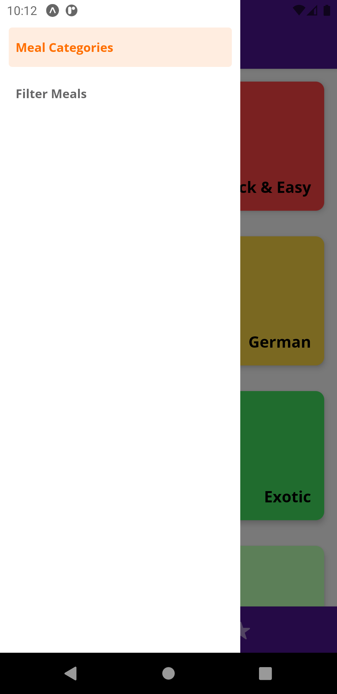

# Screenshots

# Redux

https://academind.com/learn/react/redux-vs-context-api/

State can be complex and it's important to understand this to understand which problems state management solutions like Redux actually solve.

![StateManagementExample] ("./zz_screenshots/state_mngmnt_example.JPG")

If we had an app like this, which is not the app we built but which could be an app you're building where you have two different areas, one where you manage your users, where users can sign in, where users can manage their dashboard, see their dashboard and so on and one where you have products in a list which users can add to a cart, then these areas are actually not totally independent but in your app, they will be rendered on different screens, so pretty separated from each other.

But the question whether a user is signed in which you need here might also be relevant in another part of your application and right now, you normally would have to pass that data around manually through props by passing it from component A to B to C to D all the way up to E where you then maybe need this, that's not really very convenient. Instead you want to have an application setup where something changes, for example a user signs in or in our meals app, you set a certain filter and you save that and then this information is kind of propagated to your app and automatically passed to the places where you need it but not through props but with some behind the scenes mechanism that helps you regarding this and that's where Redux is a common solution we use in React and React Native apps to manage that state.

> Now how does Redux work?

![ReduxOverview] ("./zz_screenshots/redux-overview.jpg")

First of all Redux is a third-party library which you can add to React Native to use it there and it's all about having a central store. Redux introduces a central store in memory, not a database but it's in memory, in Javascript memory so to say where your application state, so the data different parts of your app depend on can be stored in and then when in one component, you have something that wants to manipulate that state, for example we're setting a filter or we're marking a meal as a favorite, we then dispatch a so-called action, that's a pre-defined information package you would say, having a certain schema which can be handled by Redux as configured by you.

This action reaches a so-called reducer and you will be the one writing that reducer as a developer, so you can control which kind of action a reducer accepts, so which kind of information package your reducer requires and that reducer then receives the action and derives a new state based on the old state which then updates this centrally stored state. So the reducer is there to update the state in the end.

And when that store changes, when the state in there changes, you can also have subscriptions to that store from other components, these subscriptions will be triggered when your store, when your state there changes and the updated state is then passed on to the places in your app, so to the components who are interested in these changes, for example this component here could be interested in some updates, well then it can set up a subscription and it will be informed about the update and get the new state through its props or also with React hooks as you will learn in this module.

This is how Redux works and that's the idea behind Redux. Now one important note, if you're a bit further into React, you also probably know the React Context API which is built into React. This can also be used for some behind the scenes state and data management but it's not a good replacement for all use cases where you use Redux.
